[返回首页](./Home.md)
***

## 一、连接服务器所需的准备

- **n2n下载：链接：https://pan.baidu.com/s/1y2nIMJZEiKDDk3QNfUm4IA  提取码：f95m**

- 1、解压压缩包到任意位置任意目录，打开
  
，双击执行  安装程序，安装虚拟网卡 ，安装目录任意。若不理解英文可寻找翻译，安装过程略

- 2、打开文件夹，找到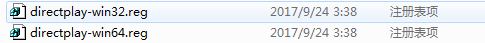reg注册表项文件，是32位的系统（32位xp或win7）就双击执行第一个reg文件，若是64位系统就双击执行第二个reg文件，弹出窗口点确定即可

- 3、打开，上方的下拉菜单选择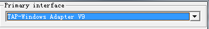虚拟网卡，下边的列表也是选中这个网卡，其余默认即可（若未关闭防火墙，请勾选），设置完成后，点击按钮，然后点击按钮

  -  关闭系统防火墙的方法：https://jingyan.baidu.com/article/17bd8e52083ce685ab2bb839.html

- 4、接着，回到文件夹，打开程序，按照下图设置照抄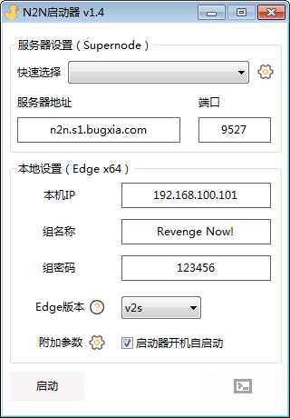（每个玩家设置的组名称和组密码必须相同）

  -   除了ip地址需要设置成不同的（后面101的最后一位改一下，改成什么要记住，后面ping要用），其余设置必须相同，设置完成后点击左下角按钮（启动前必须更改ip地址，ip地址冲突会导致无法连接）

  - 点击按钮打开软件调试窗口，用来查看是否连接成功

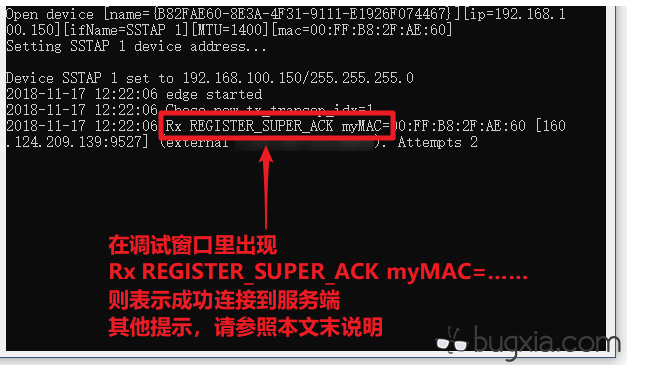

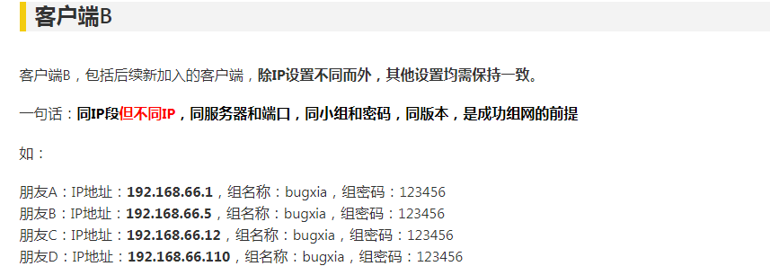

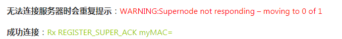

- 5、键盘Win+R键，打开运行，输入cmd，回车，在命令行窗口下，输入 ping xxx.xxx.xxx.xxx(另一位玩家的ip地址）（ip地址可不同，ping你朋友的ip地址）。若成功，会出现延迟（时间）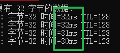

- 6、打开复仇时刻根目录，找到ra2md.exe，打开它
检查游戏版本号是否和另一台设备一致
进入游戏后在选项→网络中，与另一台设备校对局域网设定中的信息是否一致
调试好分辨率，点击主菜单的网络按钮，进入游戏大厅，若看见对方用户名，即可。

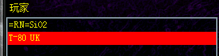

## 二、游戏大厅里看不见对方

实测发现，即使是ping通了，也可能出现看不见对方以及房间的情况
例子：大厅中有ABC三人，A和C能看见B，B却看不见A或C，C开房AB两人均看不到，B只能看见A开的房却不能看见A

这是因为主机A的IP地址和B不在一个段内
电脑不止一个网卡，而建房的时候是使用其他优先级高的网卡的ip地址，所以导致了看不见用户和房间（其原因就是进程使用其他网络的ip地址了，因为ra2不能人为修改游戏进程读取的ip地址）

- 1、
菜单栏右下角的网络图标，右键--打开网络与共享中心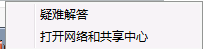--更改适配器设置

你就会看到电脑的所有网络适配器

选择这个网卡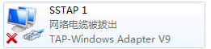并右键

然后打开属性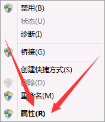，找到

选中后在点击按钮，接着点击按钮

把这里接口跃点数改成1，如图所示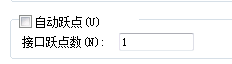，然后确定即可（跃点数越多优先级越低，跃点数越少优先级越高）

- 2、更改其他网卡的接口跃点数

按照刚刚的方法，给除了TAP-Windows Adapter V9这个虚拟网卡之外的网卡更改接口跃点数，改成9999，建议其他无关网卡（除本地连接的物理网卡外，不要改动物理网卡的参数）的跃点数全部更改，以防万一

例子：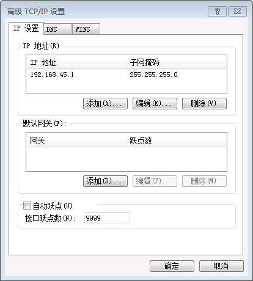

参考文献（原教程贴）：
https://bugxia.com/1796.html
https://bugxia.com/1799.html
https://bugxia.com/525.html
https://bugxia.com/1770.html

## 虚拟网卡安装失败

参见教程：https://wenku.baidu.com/view/ae2c9245a8956bec0975e3d8.html

若还有其他问题，请联系复仇时刻服务群的客服或者复仇时刻公测群的客服

***
[返回目录](./常见问题指南.md)
