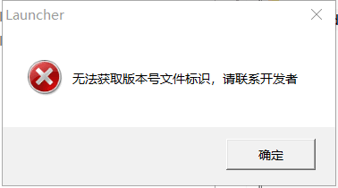
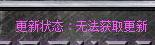

[返回首页](./Home.md)

***

* **检查网络本身问题**
  - 使用浏览器访问: **dev.tencent.com**。无法访问则是本机网络问题，可能是DNS解析失败，或者是该站点被列入了本地网络或路由器的黑名单，请**自行使用搜索引擎解决网络问题**。

* **仅启动器自身无法访问更新站点**
  - 如果上述的网络本身没有问题，即浏览器可以访问dev.tencent.com，那么请**检查防火墙是否拦截启动器**，可将启动器加入防火墙白名单，或者关闭防火墙后重新打开启动器再试，另外需检查**启动器管理员权限**，管理员权限设置方式自行搜索互联网。

* **启动器可以正常下载更新，但安装失败**
  - 启动器在安装文件的过程中提示安装失败，如果此时有杀软报毒，那么极有可能是杀软删除了下载好的更新程序，请在杀软中添加复仇时刻的文件夹为白名单，或者退出杀软后重试。
  - 安装时游戏进程没有退出，本现象在旧版启动器可能会发生，新版启动器在检测到游戏进程时会提示关闭。无论如何请注意在更新时，先退出其他已经在运行的复仇时刻程序。

* 注意：G1208需要自动更新补丁才能自动更新

* 群测更新包获取方法：[**复仇时刻最新版本**](最新版本下载.md)

***

[返回目录](./常见问题指南.md)

