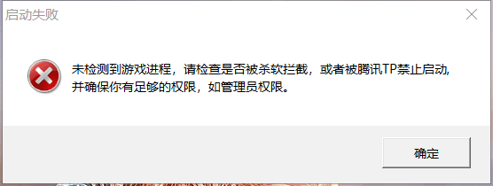

[返回首页](./Home.md)

***

- 缺少游戏关键文件。
  - 由于一些玩家并未使用完整版的安装包安装复仇时刻，一些解压即玩的二次传播版本可能存在文件缺失的问题；
  - 另外玩家群内不时推送的更新补丁程序，也需要覆盖在已安装的完整版复仇时刻文件夹内；
  - 如果你属于上述两种情况，请重新安装最新版的复仇时刻完整版。[点击获取最新版信息](最新版本下载.md)

- 遭到杀毒软件拦截。
  - 请将游戏程序和文件夹**加入白名单**，或者退出甚至卸载杀软。各个杀软白名单方式不同，请自行到互联网搜索。
  - **安装包释放文件过程中遭到杀软拦截**，使游戏关键程序无法正常释放导致launcher.exe无法读取游戏文件，请尝试关闭杀软重新安装复仇时刻

- 缺少**管理员权限**。
  - 请将**Launcher.exe、RA2MD.exe、RunRN.exe、GameRN.exe、YURI.exe、GameMD.exe****添加****管理员权限**。（管理员权限添加方法不了解的请自行到互联网搜索）
  - 0.99.H.G1208版本起，启动器已经会主动要求获得管理员权限，所以在最新版本不再会因为管理员权限无法启动。

***

[返回目录](./常见问题指南.md)

