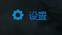
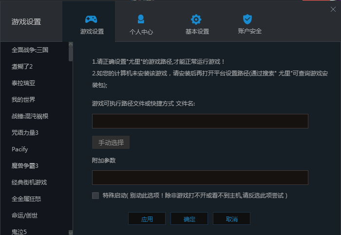

[返回首页](./Home.md)

***

- **游侠对战平台下载**
    - 普通下载：http://soft.ali213.net/pk/ali213pk_kh6.30.rar
    - 百度云下载：https://pan.baidu.com/s/1KNRKH1TeeiBix6N8bIX3aw#list/path=%2F%5B2019-07-09%5Dali213pk_kh6.30

 - 下载好游侠安装包，进行安装，这一步不会请**百度**！

 - 打开游侠对战平台，输入账号和密码，登录（可以使用QQ登录）

   - **没有账号请注册**

   - 登录成功后，会显示游侠对战平台的主页面

 

   - 左边列表里，选择**即时战略**

   - 然后，隔壁会多出一个列表，选择**尤里**

   - 然后就会看见页面显示尤里复仇的三个大区，选一个专房进入

 - 进入专房后，你要先**设置**好复仇时刻的路径才能读取到复仇时刻

   - 所以，点选上方的 **设置**   

   - 显示这个界面

   - 然后，点击 **手动选择**，寻找到你**复仇时刻的安装目录**， 并且找到复仇时刻的  **RA2MD.exe**  这个程序，找到程序后点击**确定**

     - 设置页面就会随之关闭，你就可以点击 **开始游戏** 了

- 注意：因为该游戏引擎在**分辨率过大**时将**产生极大的效能负担**（体现为游戏帧数很低），故为了游戏流畅度对联机时最大分辨率做了一定的限制。所以，切记进入游戏后点击 **选项** 来调节 **游戏分辨率** 。

- 如果你在全屏游戏时出现了黑边，请参阅这里解决黑边问题：http://jingyan.baidu.com/article/49711c61478e7bfa441b7cc0.html

- 可以进入大厅，并能看见对方的名字，即可

 
## [游戏中无法看到好友以及房间](游戏中无法看到好友以及房间.md)
 

## 窗口化

 - Win8 或者win10玩家如果想联机游戏窗口化，那么请在复仇时刻根目录找到**GameRN.EXE GameMD.EXE**并给这两个exe设置16位色。并且在游侠设置中的**附加参数**输入 -WIN，注意前面空一个空格，**注意大写。**

***

## [联机序列号问题](进入房间提示“序列号相同”.md)

***

## 3大区的选择

 - **日牛联机通常是在双线1.001**  

 - 如果是双线区延迟比较爆炸的，可以根据联机电脑网络的运营商来决定选电信区或移动区（延迟越低越好）

***
[返回上一级](./使用第三方对战平台.md)

***

[返回目录](./常见问题指南.md)

