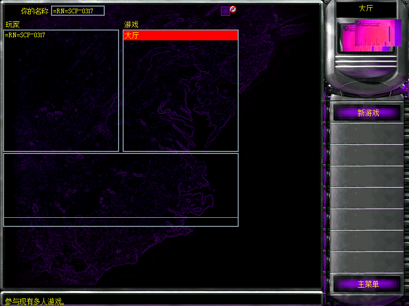
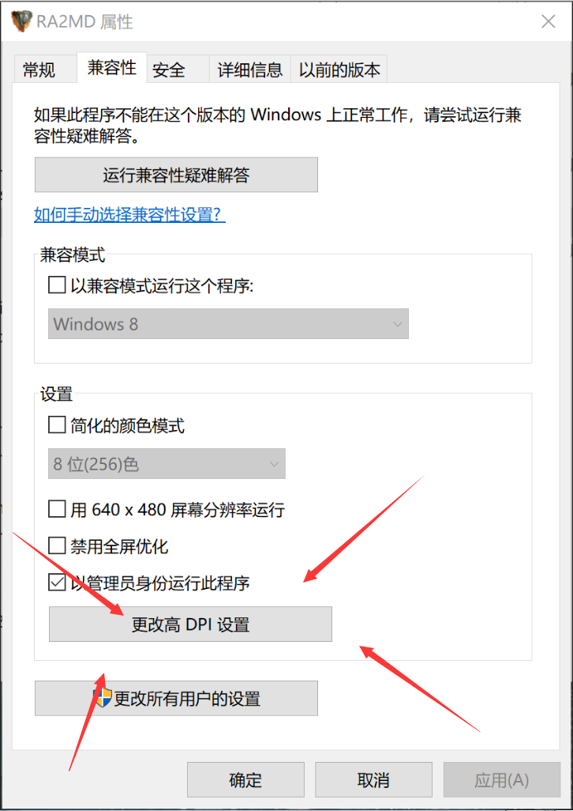
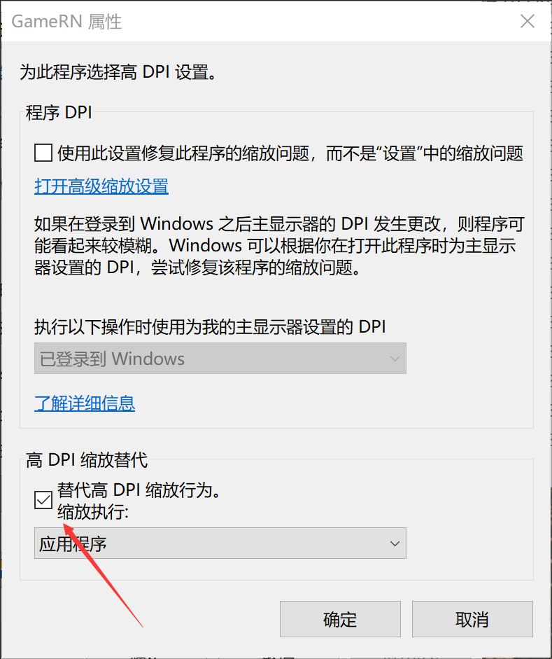

### [返回首页](./Home)

- 此问题可以通过调节**屏幕缩放比**解决，
win7用户参见这个网址：https://zhidao.baidu.com/question/137413874.html
win10用户参见这个网址：https://jingyan.baidu.com/article/af9f5a2d42a89143140a4584.html

- 若不想修改全局dpi的可以在**复仇时刻主程序**的 属性--兼容性 里打开高dpi时禁用显示缩放

  - win10系统给软件单独禁用dpi稍微麻烦一些： 先点击"更改高dpi设置"   然后给”代替搞dpi缩放行为“打钩（请给复仇时刻主程序全部设置一遍）

  - 尝试**切换显示补丁**：参见[运行后菜单不显示问题](运行后菜单不显示问题)

- 注意：若画面移动有明显卡顿感，是使用了错误的显示补丁

- 或者到https://msdn.itellyou.cn/
msdn下载win7正版系统镜像，**重新安装正版系统**，因为这可能由系统导致的

### [返回目录](./常见问题指南)