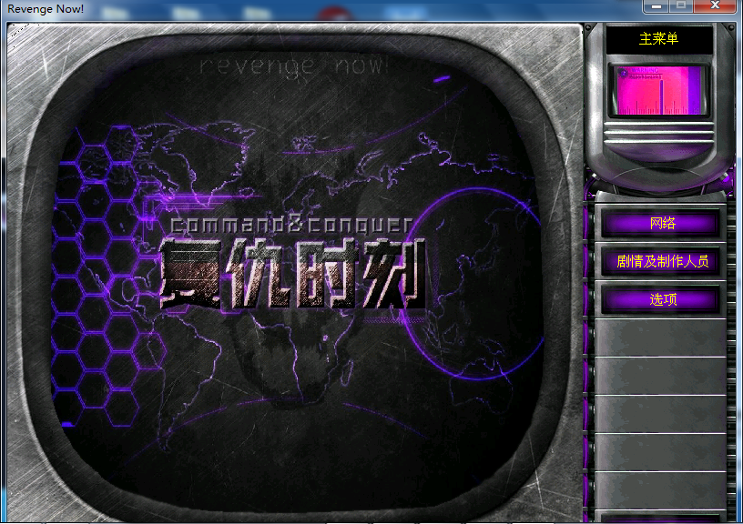
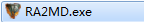
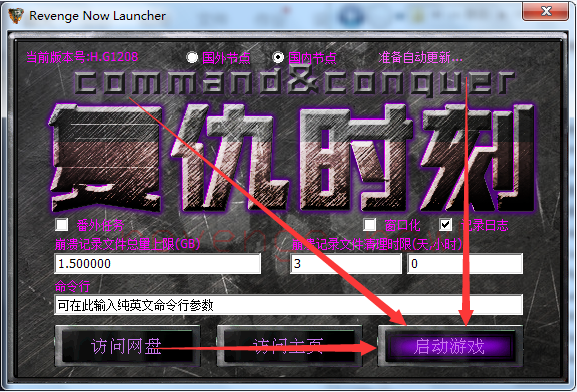
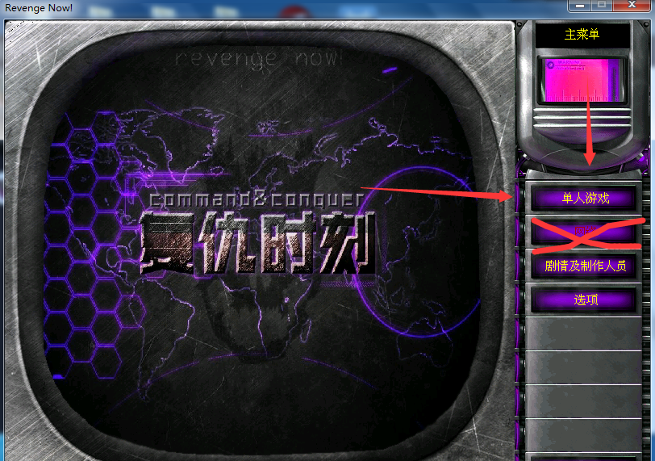

[返回首页](./Home.md)

***

- 若出现以上情况，则是你运行了或者，ra2md.exe和yuri.exe是联机时使用的，复仇时刻有专门的单机游戏启动器：**launcher.exe**

- 通过启动游戏才能游玩单机内容

- 注：**单机模式下不能进入局域网大厅**

- 联机教程:[游侠或浩方联机方法](使用第三方对战平台)/[N2N联机教程](使用N2N虚拟局域网进行联机)

***
[返回目录](./常见问题指南.md)
