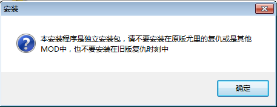
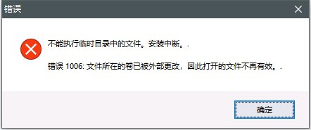
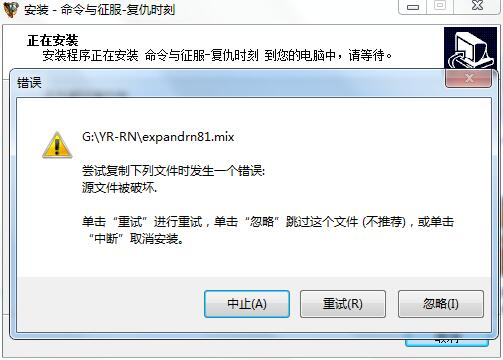

[返回首页](./Home.md)

***

# 独立安装包使用注意事项

## 1、下载安装包

- [最新版本下载](./最新版本下载.md)

## 2、安装之前要关闭杀软

- **杀软会拦截安装包执行安装程序**，影响或者阻止安装

## 3、不要覆盖安装

- **安装包是独立的**，安装好即可游玩，不需要覆盖在RA2或者YR上

# 安装过程中显示错误1006

- 安装过程中弹出该弹窗，请**关闭安装程序**并且**检查杀软是否拦截安装包**，确认关闭杀软之后再安装一次

- **安装之前请关闭杀软**，以防更多问题的发生

# 安装过程中提示源文件损坏

- 安装包下载过程中由于网络问题导致损坏，重新下载安装即可。

***
[返回目录](./常见问题指南.md)
