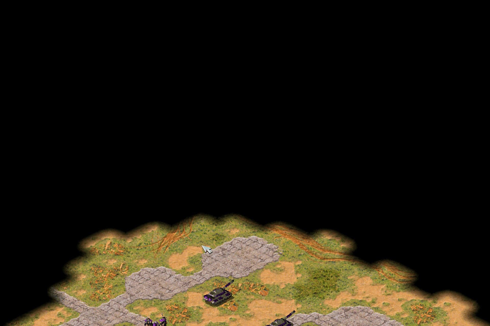
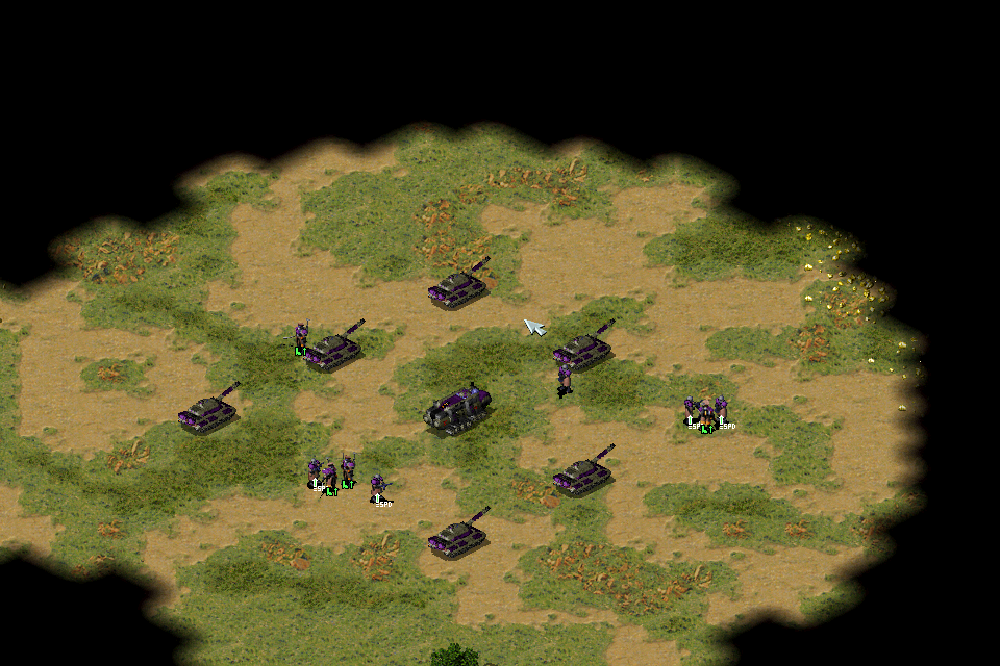

[返回首页](./Home.md)

***

## 游戏画面向左或者向右偏移

- 这可能会导致**画面的某一边显示不出来以及四周有黑边**，**画面无法铺满整个屏幕**（画面向右偏移导致建造栏无法显示完全，画面向左偏移暂无实例）

- 一：

  - 点开始（或者win键+r），打开运行窗口，输入regedit 回车，这样就打开了注册表编辑器，然后，定位到以下位置： HKEY_LOCAL_MACHINE\\SYSTEM\\ControlSet001\\Control\\GraphicsDrivers\\Configuration\\

  - 在Configuration这上面右键，选择查找，输入Scaling，在右框找到scaling，右键scaling修改，将数值改为3即可。

  - 具体图文教程地址：http://jingyan.baidu.com/article/49711c61478e7bfa441b7cc0.html

- 二：

  - 画面偏移可能是由切换了分辨率之后显示器的画面自动校正调整导致的，请根据你的显示器型号查询教程并按照教程手动调整显示器相关设置

## 游戏画面显示不完全
 

- 类似以上这种，只能显示游戏画面一部分，并且**分辨率大于1920x1280**的

  - 降低桌面分辨率，至多为1920x1280，并且把**dpi改为100%**（系统会根据分辨率调整 dpi，大于2k分辨率的电脑dpi大多不是100%），若不想修改全局dpi的可以在**复仇时刻主程序**的 属性--兼容性 里打开高dpi时禁用显示缩放

  - win10系统给软件单独禁用dpi稍微麻烦一些： 先点击"更改高dpi设置"   然后给”代替搞dpi缩放行为“打钩

- **切记：请勿把RA2MD.ini中分辨率改成大于2k的分辨率，会导致游戏崩溃**

***
[返回目录](./常见问题指南.md)
