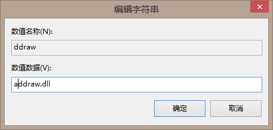
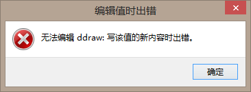

[返回首页](./Home.md)

***
 

## 0.99.902版本
理论上99%的玩家使用该版本不会出现问题，如果你是该版本但仍然有问题，请看下文[渲染补丁没有效果，怎么办？](./运行后菜单不显示问题.md#渲染补丁没有效果怎么办)

## 0.99.G1208等旧版本
请更新到0.99.902版本，然后尝试进入游戏。如果仍然有该问题，请参照下文[渲染补丁没有效果，怎么办？](./运行后菜单不显示问题.md#渲染补丁没有效果怎么办)

## 渲染补丁没有效果，怎么办？

- 注意：请**确保使用过所有补丁都不生效**再使用此方法，该方法适用于除xp（及xp以前的win系统）以外win用户，0.99.902起的版本可以直接看下面的步骤。

首先，使用**win（菜单键）+r**快捷键，呼出“运行”窗口，在输入框内输入regedit，回车（确定）。或者在C盘找到window文件夹、regedit.exe，即可启动注册表编辑器

接着，弹出注册表编辑器，根据以下目录
**HKEY_LOCAL_MACHINE\SYSTEM\CurrentControlSet
\Control\Session Manager\KnownDLLs**
找到**ddraw**的那一条，

双击打开，于“数值数据”输入框内添加任意内容（例如在**前面加一个a**） 

改完后，关闭注册表编辑器，**重启电脑**，然后再回到根目录，再**重新尝试安装合适的补丁(0.99.902版本起仅重启即可)**，直到合适为止。

若出现“编辑值时出错” 
，不能编辑的情况下，在C盘找到window文件夹、regedit.exe，鼠标右键“**用管理员身份运行**”，若仍然不允许编辑，那么参见这个教程：[教程链接](https://baijiahao.baidu.com/s?id=1604347607947449668&wfr=spider&for=pc&isFailFlag=1)

***
[返回目录](./常见问题指南.md)
