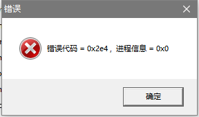

[返回首页](./Home.md)
***

- 这个问题在**非最新版本**下会出现，因为启动器**没有设置管理员权限**，而且用户的UAC设置可能默认没有赋予足够的权限，因此只需要**给启动器设置好管理员权限**即可。

- win10用户如何添加管理员权限请[点击此处](https://jingyan.baidu.com/article/93f9803f4e8a58e0e46f55db.html)

- 而**最新版本**在启动器的编译选项里**增加了获取管理员权限**的功能， 所以即使不手动设置也会自动去获取

***
[返回目录](./常见问题指南.md)
